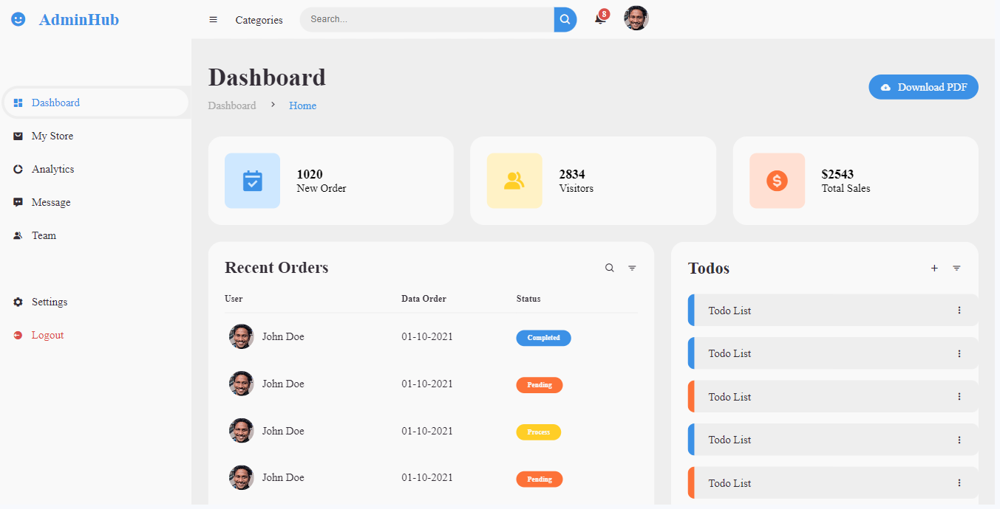

# ADMIN-DASHBOARD

This is a solution to RESPONSIVE ADMIN DASHBOARD.

## Table of contents

- [Overview](#overview)
  - [The challenge](#the-challenge)
  - [Screenshot](#screenshot)
  - [Links](#links)
- [My process](#my-process)
  - [Built with](#built-with)
  - [What I learned](#what-i-learned)
  - [Continued development](#continued-development)
  - [Useful resources](#useful-resources)
- [Author](#author)
- [Acknowledgments](#acknowledgments)

## Overview

### The challenge

Users should be able to:

- View the optimal layout for the site depending on their device's screen size.

### Screenshot

### Links

- Solution URL: [https://github.com/manjubhaskar02/Admin-Dashboard](https://github.com/manjubhaskar02/Admin-Dashboard)
- Live Site URL: [https://manjubhaskar02.github.io/Admin-Dashboard/](https://manjubhaskar02.github.io/Admin-Dashboard/)

## My process

### Built with

- Semantic HTML5 markup
- CSS custom properties
- Javascript
### What I learned

With this project, I learned to use flex and also javascript.

### Continued development

Want to focus on javascript more.
### Useful resources
I got inspired from this youtube video and decided to do this work.

https://www.youtube.com/watch?v=CkVrmLLHmuI&t=2620s

## Acknowledgments
I am very grateful to this youtube video & also
 want to thank my hubby, Safaldas who always push me to do the challenges and my mentor Sneha .
